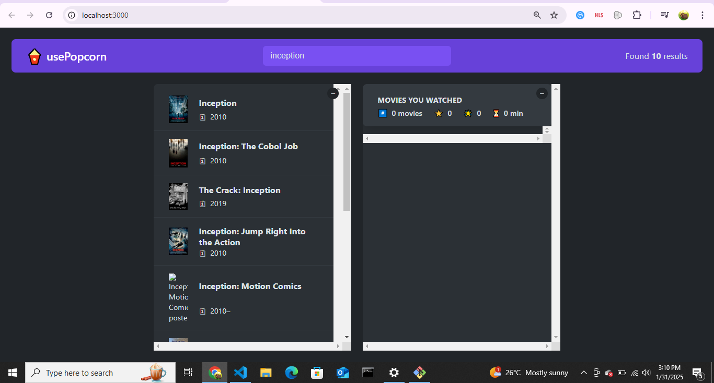
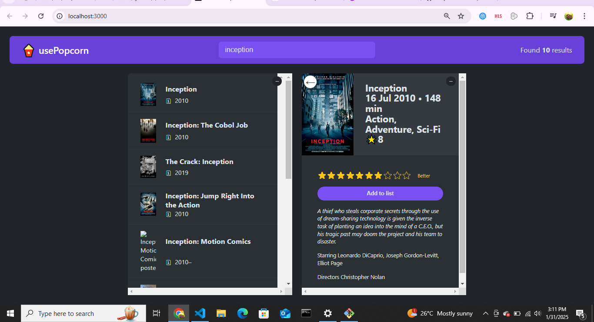
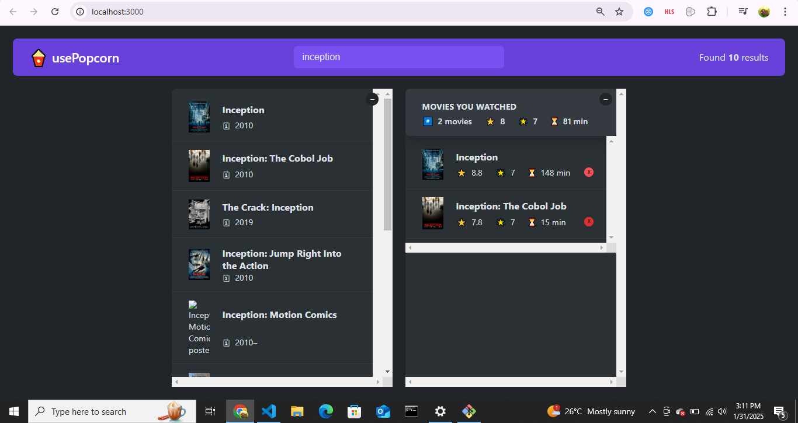

# usePopcorn 🍿

A React-based movie search and tracking application that allows users to search for movies, view details, rate them, and maintain a watchlist.

## Screenshots





## Features

- **Movie Search**: Search for movies using the OMDB API
- **Detailed Movie Information**: View comprehensive details about each movie including:
  - Release date
  - Runtime
  - Genre
  - IMDb rating
  - Plot summary
  - Cast and director information
- **Personal Rating System**: Rate movies on a scale of 1-10 with custom rating messages
- **Watchlist Management**: 
  - Add movies to your watched list
  - View your ratings alongside IMDb ratings
  - Calculate average ratings and runtime of watched movies
  - Remove movies from your watched list
- **Responsive Design**: Clean and intuitive user interface
- **Keyboard Navigation**: Close movie details using the Escape key

## Technical Features

- Real-time search with API integration
- Loading states and error handling
- AbortController for request cancellation
- Custom hooks for state management
- Dynamic document title updates
- Responsive components and layouts

## Installation

1. Clone the repository:
```bash
git clone https://github.com/Zakyboss/usePopcorn.git
```

2. Navigate to the project directory:
```bash
cd usePopcorn
```

3. Install dependencies:
```bash
npm install
```

4. Create a `.env` file and add your OMDB API key:
```
REACT_APP_OMDB_KEY=your_api_key_here
```

5. Start the development server:
```bash
npm start
```

## Usage

1. Enter a movie title in the search bar
2. Click on a movie to view detailed information
3. Rate the movie using the star rating system
4. Click "Add to list" to add the movie to your watched list
5. View your watched movies and statistics in the right panel
6. Remove movies from your watched list using the 'X' button

## Dependencies

- React
- React DOM
- OMDB API for movie data

## Contributing

Feel free to submit issues and enhancement requests!

1. Fork the repo
2. Create your feature branch
3. Commit your changes
4. Push to the branch
5. Create a new Pull Request

## Author

[@Zakyboss](https://github.com/Zakyboss)

## License

This project is open source and available under the [MIT License](LICENSE).